# 3RMatch

## Nome do projeto

O nome do projeto é inspirado no conceito dos 3Rs da sustentabilidade — Reduzir, Reutilizar e Reciclar — combinado com a ideia de match, representando a conexão entre pessoas que possuem materiais recicláveis e coletores interessados em coletá-los.

## Descrição

O 3RMatch é uma plataforma digital que conecta pessoas que desejam descartar materiais recicláveis com coletores que buscam esse tipo de material para coleta e posterior reciclagem. A aplicação tem como objetivo facilitar o descarte correto de resíduos, incentivar a reciclagem e contribuir para a economia circular. Ao criar um sistema de correspondência (match) entre oferta e coleta de recicláveis, o 3RMatch ajuda a reduzir o desperdício e a melhorar a eficiência da coleta.

## Funcionalidades

Entre as principais funcionalidades do sistema estão:

- cadastro de materiais recicláveis disponíveis para coleta
- localização de coletores próximos
- sistema de match entre doadores e coletores
- registro das solicitações de coleta
- histórico de coletas realizadas

## Como usar

1. Crie uma conta no sistema (e-mail ou via SSO).
2. Informe a disponibilização do material reciclável.
3. O sistema identifica coletores próximos interessados no material.
4. Um coletor aceita a solicitação e o sistema cria um match.
5. A coleta é realizada e registrada no sistema.

## Requisitos
### Requisitos Funcionais (RF)
#### Gestão de Usuários
RF01 – O sistema deve permitir o cadastro de usuários utilizando autenticação via SSO (Google, Facebook ou Apple).
RF02 – O sistema deve permitir que o usuário informe seus dados básicos (nome, endereço e telefone).
RF03 – O sistema deve permitir que o usuário selecione seu tipo de perfil (Usuário ou Coletor).
RF04 – O sistema deve permitir a visualização das informações do perfil cadastrado.
#### Cadastro de Materiais
RF05 – O sistema deve permitir que usuários cadastrem materiais recicláveis disponíveis para coleta.
RF06 – O sistema deve permitir informar o tipo e a quantidade de material.
RF07 – O sistema deve exibir a lista de materiais cadastrados para consulta.
#### Localização de Coletores
RF08 – O sistema deve exibir coletores disponíveis próximos ao usuário.
RF09 – O sistema deve apresentar os coletores em formato de lista e em visualização de mapa.
RF10 – O sistema deve permitir que o usuário visualize informações básicas do coletor (nome e distância).
#### Sistema de Match
RF11 – O sistema deve sugerir coletores com base na localização e no tipo de material disponível.
RF12 – O sistema deve permitir que o usuário solicite a coleta a um coletor disponível.
RF13 – O sistema deve permitir que o coletor aceite ou recuse solicitações de coleta.
RF14 – O sistema deve registrar a criação de um match entre usuário e coletor.
#### Solicitações de Coleta
RF15 – O sistema deve registrar as solicitações de coleta realizadas.
RF16 – O sistema deve permitir o acompanhamento do status da coleta (pendente, aceita, concluída).
####  Histórico de Coletas
RF17 – O sistema deve manter um histórico das coletas realizadas.
RF18 – O sistema deve permitir a visualização dos detalhes das coletas anteriores.

### Requisitos Não Funcionais (RNF)
#### Desempenho
RNF01 – O sistema deve responder às requisições do usuário em até 2 segundos, em condições normais de uso.
RNF02 – O sistema deve suportar múltiplos usuários simultâneos sem degradação significativa de desempenho.
RNF03 – As operações de consulta (ex: listagem de materiais e coletores) devem ser rápidas (resposta inferior a 5 segundos).
#### Segurança
RNF04 – O sistema deve garantir autenticação segura via SSO (Google, Facebook e Apple).
RNF05 – O sistema deve proteger os dados dos usuários contra acesso não autorizado.
RNF06 – O sistema deve utilizar comunicação segura via HTTPS.
RNF07 – Informações sensíveis devem ser armazenadas de forma segura.
#### Usabilidade
RNF08 – O sistema deve possuir interface intuitiva e de fácil utilização.
RNF09 – O sistema deve ser responsivo, funcionando em dispositivos móveis e desktops.
RNF10 – O fluxo principal (cadastro → match → coleta) deve ser simples e direto.
#### Disponibilidade
RNF11 – O sistema deve estar disponível 24 horas por dia, 7 dias por semana, salvo períodos de manutenção.
RNF12 – O sistema deve possuir alta disponibilidade, minimizando indisponibilidades.
#### Escalabilidade
RNF13 – O sistema deve ser capaz de escalar para suportar aumento no número de usuários e transações.
RNF14 – A arquitetura deve permitir expansão futura sem necessidade de grandes mudanças estruturais.
#### Manutenibilidade
RNF15 – O código do sistema deve ser organizado e modular.
RNF16 – O sistema deve ser de fácil manutenção e evolução.
RNF17 – O sistema deve seguir boas práticas de desenvolvimento (ex: componentização no frontend).
#### Confiabilidade
RNF18 – O sistema deve garantir consistência das informações registradas.
RNF19 – O sistema deve evitar perda de dados em caso de falhas.
RNF20 – O sistema deve registrar eventos importantes (ex: solicitações de coleta).
#### Compatibilidade
RNF21 – O sistema deve ser compatível com os principais navegadores modernos (Chrome, Edge, Firefox).
RNF22 – O sistema deve funcionar corretamente em diferentes tamanhos de tela.

## Diagramas
### Diagramas de Caso de Uso 
#### Visão Geral
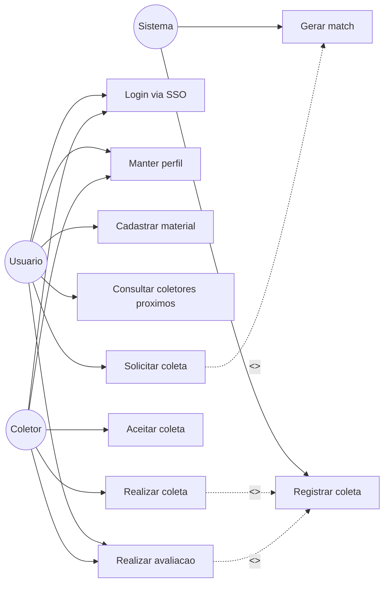
#### Usuário
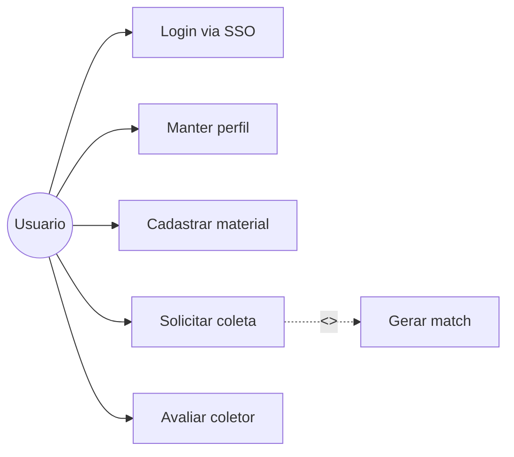
#### Coletor
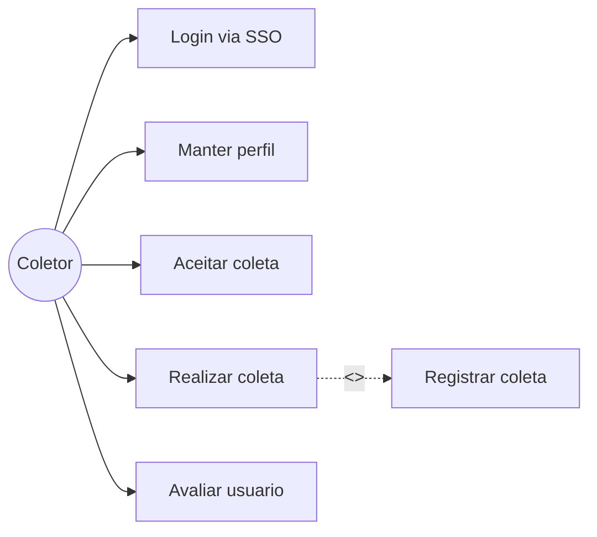
#### Sistema
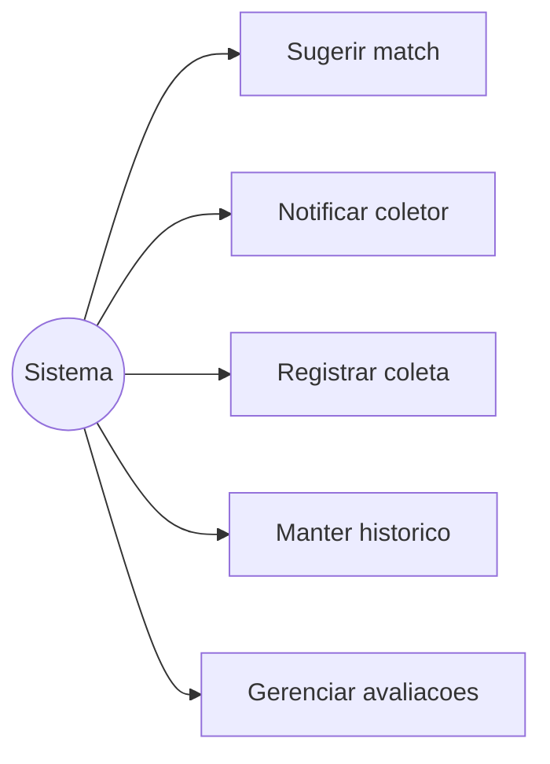
### Diagramas de Sequência

#### Login com SSO
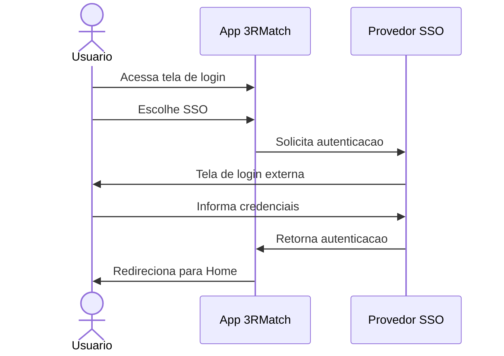

#### Manutenção de Usuário
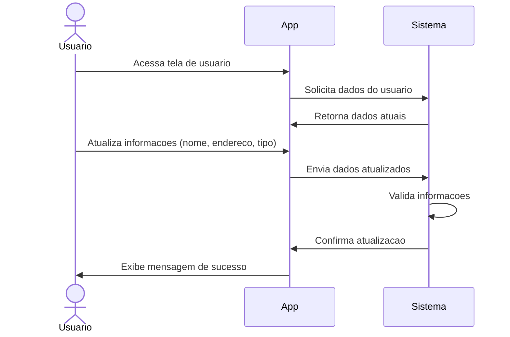

#### Cadastrar Material
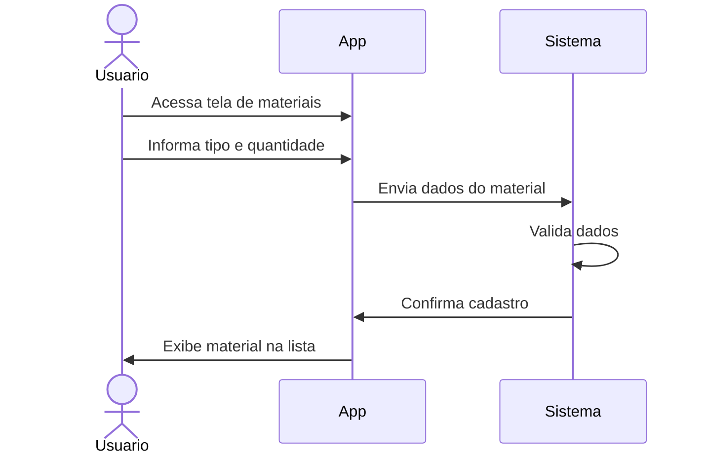

#### Localizar Coletor
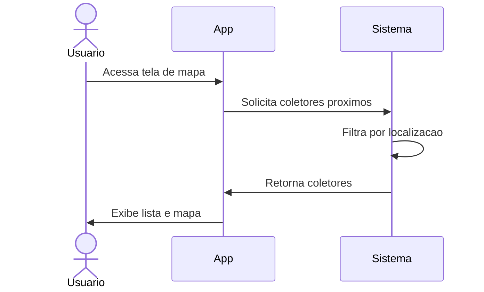

#### Solicitar Coleta
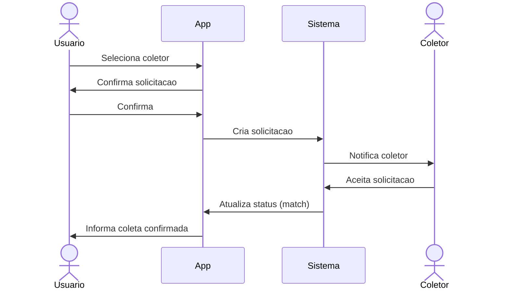

#### Registrar Coleta
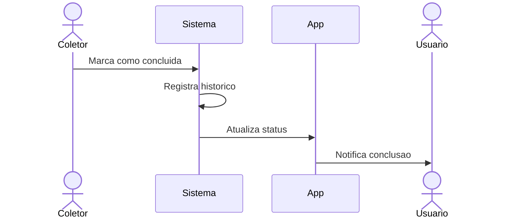
### Diagramas de Estado

#### Estado do Usuário
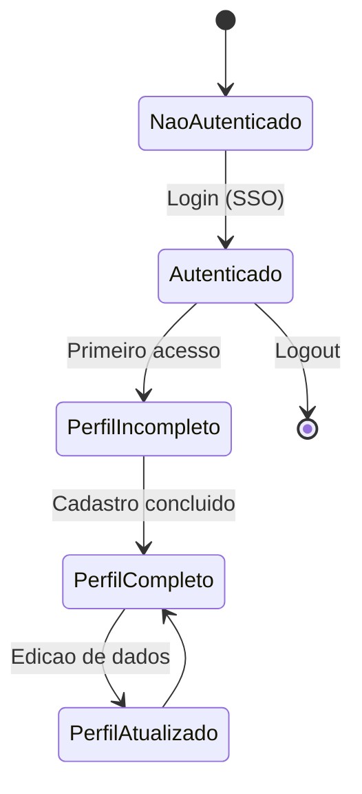
#### Estado do Material
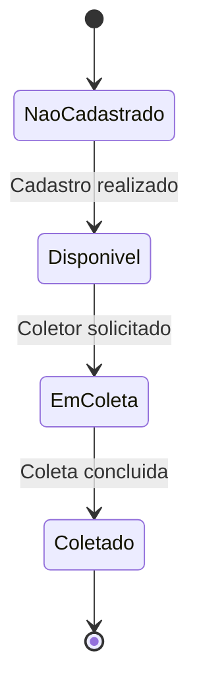
#### Estado da Solicitação de Coleta
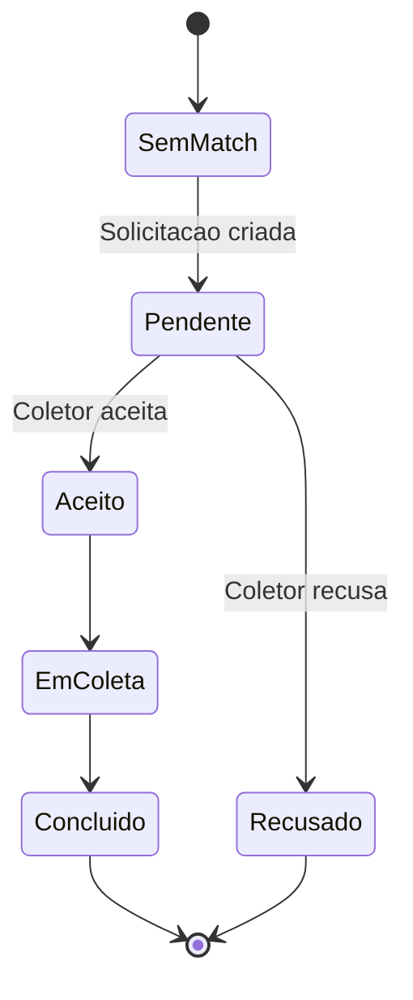
#### Estado da Coleta
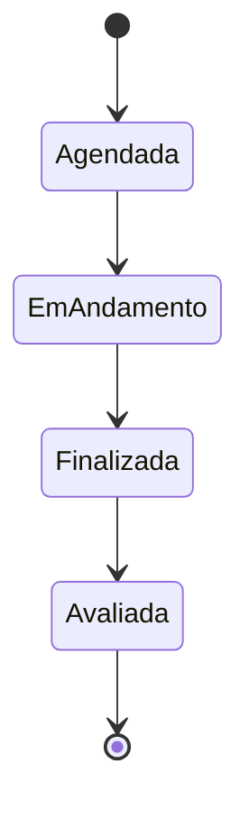

## Protótipos de Telas
### Tela do Login

  

### Tela do Menu

  

### Tela do Cadastro de Usuário

  

### Tela do Cadastro de Materiais

  

### Tela de Localização de Coletores

  

### Tela de Match

  

### Tela de Histórico de Coletas

  

